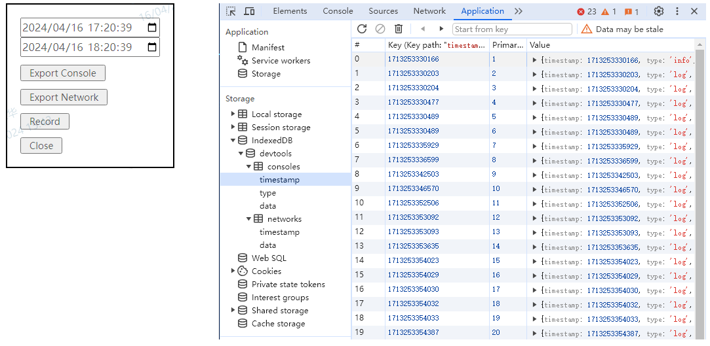
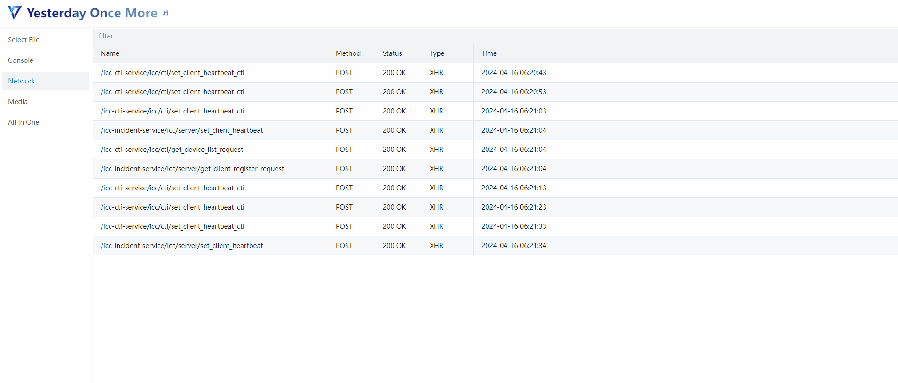

  

  <h1>Yesterday Once More</h1>

A log reviewer system.

## Description

Resolve an issue that browser app could not be localized.

- **yom-lib** store the logs(console and network) to IndexDB; export the logs to local file
- **src** logs viewer

### yom-lib

1. The `console` and `network` methods have been rewritten to store the data in IndexDB
2. Press `Ctrl + Alt + 6`, Wake up the export panel, which supports exporting within a specific time period logs (`console` or `network`)
3. Screen recording is supported

### yom-client

1. Show `console` details
2. Show `network` details
3. Play the screen record

## Todo List

- [x] rewritten console.debug 
- [x] add the filter for Network and Console
- [x] Batch import of logs 
- [x] Add time zone configuration

## Special Thanks

- DongLiang Fan's idea
- https://github.com/Nice-PLQ/devtools-remote-debugger : The original inspiration
- https://github.com/HuolalaTech/page-spy-web Referring to this article, I made an interface by myself

## Version Update

Details of the version update: [README_VERSIONS](./README_VERSIONS.md)
